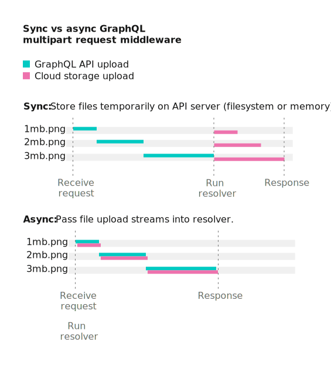

# GraphQL multipart request specification

[](https://github.com/jaydenseric/graphql-multipart-request-spec/releases)

An interoperable [multipart form](https://tools.ietf.org/html/rfc7578) field structure for GraphQL requests, used by various file upload client/server implementations.

It’s possible to implement:

* Files nested anywhere within operations (typically in `variables`).
* Batched operations.
* File deduplication.
* File upload streams in resolvers.
* Aborting file uploads in resolvers.



## Multipart form field structure

An “operations object” is an [Apollo GraphQL POST request](https://www.apollographql.com/docs/apollo-server/requests.html#postRequests) (or array of requests if batching). An “operations path” is an [`object-path`](https://npm.im/object-path) string to locate a file within an operations object.

So operations can be resolved while the files are still uploading, the fields are ordered:

1. `operations`: A JSON encoded operations object with files replaced with `null`.
2. `map`: A JSON encoded map of where files occurred in the operations. For each file, the key is the file multipart form field name and the value is an array of operations paths.
3. File fields: Each file extracted from the operations object with a unique, arbitrary field name.

## Examples

### Avatar mutation

#### Operations

```js
{
  query: '…',
  operationName: 'updateAvatar',
  variables: {
    userId: '…',
    image: File
  }
}
```

#### Multipart form fields

1. `operations`: `{"query": "…", "operationName": "updateAvatar", "variables": {"userId": "…", image: null}}`
2. `map`: `{"1": ["variables.image"]}`
3. `1`: File

### Gallery mutation

#### Operations

```js
{
  query: '…',
  operationName: 'addToGallery',
  variables: {
    galleryId: '…',
    images: [File, File, File]
  }
}
```

#### Multipart form fields

1. `operations`: `{"query": "…", "operationName": "addToGallery", "variables": {"galleryId": "…", images: [null, null, null]}}`
2. `map`: `{"1": ["variables.images.0"], "2": ["variables.images.1"], "3": ["variables.images.2"]}`
3. `1`: File
4. `2`: File
5. `3`: File

### Batched mutations

#### Operations

```js
[
  {
    query: '…',
    operationName: 'updateAvatar',
    variables: {
      userId: '…',
      image: File
    }
  },
  {
    query: '…',
    operationName: 'addToGallery',
    variables: {
      galleryId: '…',
      images: [File, File, File]
    }
  }
]
```

#### Multipart form fields

1. `operations`: `[{"query": "…", "operationName": "updateAvatar", "variables": {"userId": "…", image: null}}, {"query": "…", "operationName": "addToGallery", "variables": {"galleryId": "…", images: [null, null, null]}}]`
2. `map`: `{"1": ["0.variables.image", "1.variables.images.0"], "2": ["1.variables.images.1"], "3": ["1.variables.images.2"]}`
3. `1`: File
4. `2`: File
5. `3`: File

## Implementations

### Client

* [apollo-upload-client](https://github.com/jaydenseric/apollo-upload-client) (JS: [npm](https://npm.im/apollo-upload-client))
* [apollo-fetch-upload](https://github.com/apollographql/apollo-fetch/tree/master/packages/apollo-fetch-upload) (JS: [npm](https://npm.im/apollo-fetch-upload))
* [extract-files](https://github.com/jaydenseric/extract-files) (JS: [npm](https://npm.im/extract-files))

### Server

* [apollo-upload-server](https://github.com/jaydenseric/apollo-upload-server) (JS: [npm](https://npm.im/apollo-upload-server))
* [apollo_upload_server](https://github.com/jetruby/apollo_upload_server-ruby) (Ruby: [Gem](https://rubygems.org/gems/apollo_upload_server))
* [ecodev/graphql-upload](https://github.com/Ecodev/graphql-upload) (PHP: [Composer](https://packagist.org/packages/ecodev/graphql-upload))
